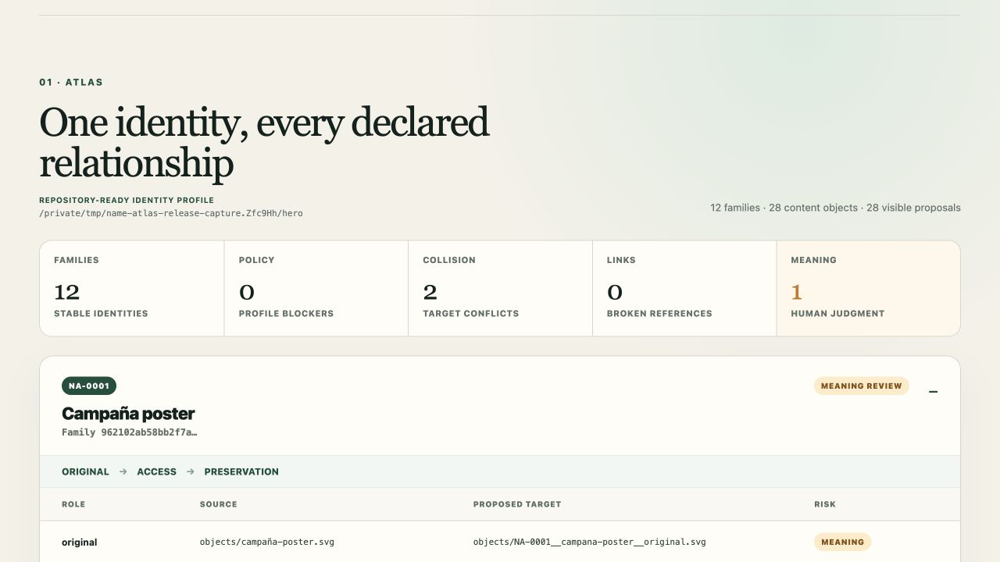
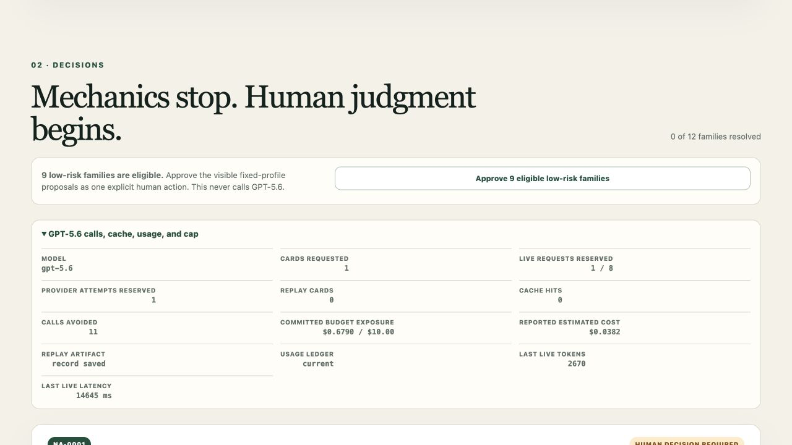
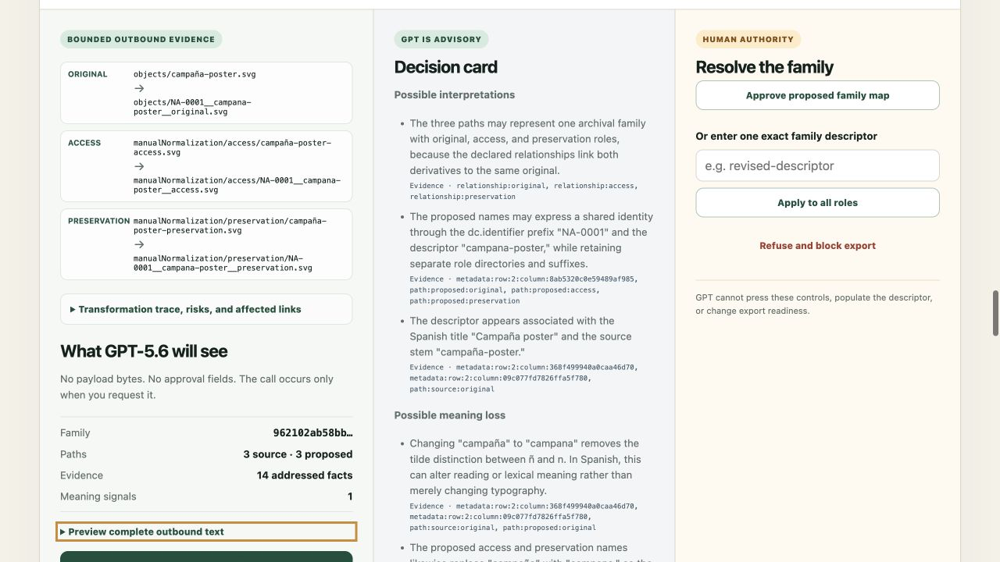
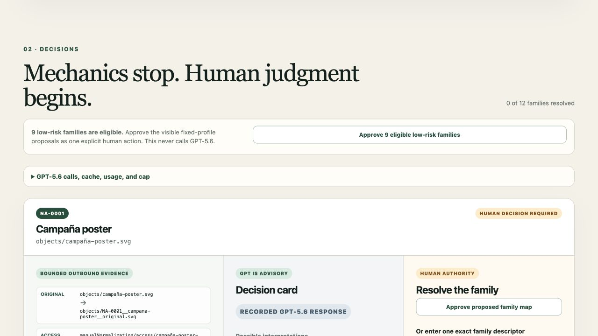
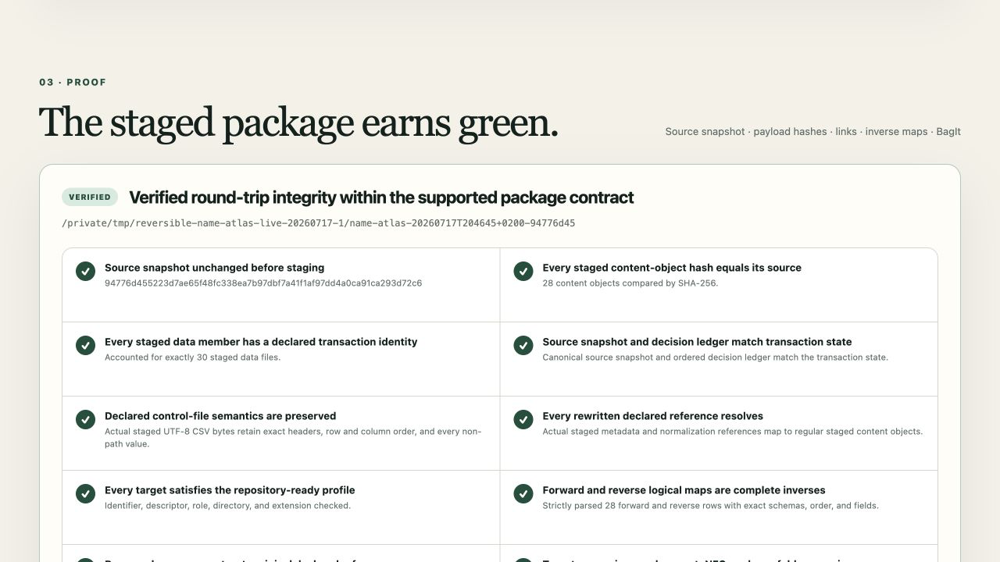
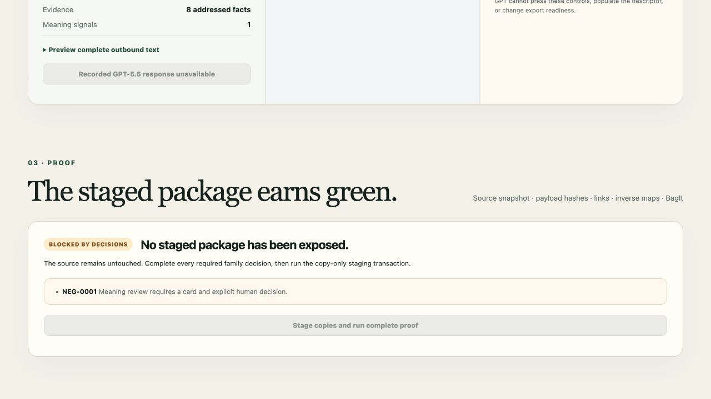

# Reversible Name Atlas

**Refactor the collection. Preserve every identity.**

Reversible Name Atlas is a local-first migration workbench for linked digital
collections. It previews canonical renames and structural moves, keeps original
objects and declared derivatives together, exposes mechanical and Meaning risks,
and promotes a copy-only staged BagIt package only after every required human
decision and deterministic check succeeds.

The initial user is a digital-preservation specialist or processing archivist
preparing a collection for preservation or repository ingest. The problem is
not just changing a filename: one identity can also appear in metadata,
derivative relationships, paths, and manifests. A bulk rename can leave those
declared relationships inconsistent. Name Atlas makes the complete supported
transaction visible before staging and produces durable forward, reverse, and
verification evidence afterward.

## Current release status

The product surface is feature-frozen. The included hero package has 12 object
families, 28 content objects, and 30 source-package members. Automated and
browser checks have exercised its strict import, proposals, collision handling,
explicit human decisions, copy-only staging, logical-path round trip, and
Library of Congress `bagit` validation. The current release suite has 116
passing tests.

The canonical replay artifact is a sanitized, evidence-bound record from one
real `gpt-5.6` call made on 17 July 2026. The provider reported 1,676 input
tokens, 994 output tokens, and 2,670 total tokens. The application measured
14.645 seconds of end-to-end latency, estimated USD 0.0382 in model cost, and
retained a conservative USD 0.6790 budget reservation. The complete 12-family
transaction then passed twice in replay mode with `OPENAI_API_KEY` absent,
including staging, inverse maps, reverse dry run, and `bagit` validation.

Replay is therefore the stable, keyless judge path. Live mode remains available
for an explicit user-requested call when a local key is configured. No other
model is substituted in either mode.

## Product states

These captures document the release transaction and its authority boundaries.
The live and replay images use the same validated evidence-bound card; replay
does not make another API request.













## Authority model

| Actor | What it does | What it cannot do |
|---|---|---|
| Deterministic engine | Scans declared structure, proposes paths, detects mechanical risk, propagates decisions, stages copies, and verifies invariants | Infer semantic intent |
| GPT-5.6 | Turns bounded, visible text evidence for a mechanically flagged Meaning risk into a neutral, evidence-linked decision card | Approve, edit, verify, select a final target, or make a package exportable |
| Human | Approves, edits, refuses, or leaves each family unresolved | Bypass mechanical blockers or verification failures |

Green is reserved for deterministic verification after required human
decisions. Amber means human judgment remains. Red means a mechanical blocker
or failed invariant. GPT prose is displayed neutrally.

The browser application binds only to `127.0.0.1`. A live card is the one
intentional external operation: after showing the complete outbound evidence,
the application waits for the user's explicit Generate action and sends only
that bounded text to OpenAI. It never sends source payload bytes.

## Supported package contract

Name Atlas intentionally supports one package shape and one transformation
profile:

```text
<selected-root>/
├── objects/
│   └── ... original regular files ...
├── manualNormalization/
│   ├── access/
│   │   └── ... optional access derivatives ...
│   └── preservation/
│       └── ... optional preservation derivatives ...
├── metadata/
│   └── metadata.csv
└── normalization.csv  # optional when no derivatives exist
```

Core rules:

- every source-package member is an in-scope regular file; symlinks, special
  files, path traversal, absolute references, and unexpected members fail
  closed;
- `metadata/metadata.csv` is required UTF-8 CSV with `filename` first and
  exactly one `dc.identifier` column;
- each identifier is non-empty, NFC-normalized, unique, at most 64 characters,
  and matches `[A-Za-z0-9][A-Za-z0-9._-]{0,63}`;
- metadata has exactly one row for every original below `objects/`;
- optional `normalization.csv` is headerless UTF-8 CSV with exactly the fields
  `original,access derivative,preservation derivative`;
- an original may have at most one access and one preservation derivative, and
  every derivative is declared exactly once;
- only the declared `filename` and normalization path fields are rewritten;
  all other metadata values are preserved by the supported transaction; and
- any malformed, ambiguous, orphaned, colliding, refused, unresolved, changed,
  or unsupported input blocks the complete package before promotion.

The fixed **Repository-ready identity profile** derives one descriptor from the
original filename, adopts the family's `dc.identifier`, adds an explicit role,
and proposes leaves of the form:

```text
{identifier}__{descriptor}__{role}{lowercase_extension}
```

Targets are checked independently under exact, NFC, and Unicode-casefold
comparison. The source package is never renamed, edited, or deleted by the
staging transaction.

See the exact contract in
[`docs/build/BUILD_SPEC.md`](docs/build/BUILD_SPEC.md) and the bounded exclusions
in [`docs/LIMITATIONS.md`](docs/LIMITATIONS.md).

## Quick start

Prerequisites:

- Python 3.11; and
- [`uv`](https://docs.astral.sh/uv/).

The judge path has been tested on macOS. Linux and Windows are not release-test
claims for this Build Week version.

Install the locked environment:

```text
uv sync --frozen
```

Start the included hero package on <http://127.0.0.1:8000>:

```text
uv run name-atlas demo --mode replay
```

This command needs no API key. For the included hero package it loads only the
canonical evidence-bound record at
`src/name_atlas/recordings/hero_decision_card.json` and labels the card
**Recorded GPT-5.6 response**. It never reuses that record for a different
source fingerprint.

For live mode, configure `OPENAI_API_KEY` in the launching environment. Do not
put the key in this repository, command history, screenshots, logs, or chat.
Then run:

```text
uv run name-atlas demo --mode live
```

Without a nonblank local key, live mode exits before starting the server. A live
request is made only when the user presses the Meaning card's Generate control.
The implementation uses the exact `gpt-5.6` model alias and does not silently
fall back.

## Select a local source and output

Use absolute paths or paths relative to the current shell:

```text
uv run name-atlas demo --mode replay \
  --source "/absolute/path/to/supported-package" \
  --output "/absolute/path/to/staging-parent"
```

For a selected collection that requires a Meaning card, use `--mode live` after
local key configuration. Replay records are bound to the complete evidence
fingerprint; the hero recording is never reused for another source.

`--output` selects a staging parent. Name Atlas allocates a new pending and final
stage below it and will not overwrite an existing stage. Use `--port PORT` if
port 8000 is occupied.

## Hero workflow

The included [`sample_data/hero`](sample_data/hero) fixture is synthetic and
redistributable. It demonstrates the full supported contract:

1. **Atlas** shows 12 stable families, 28 content objects, declared derivative
   links, the fixed profile, proposed moves, and Policy, Collision, Links, and
   Meaning risk counts.
2. Explicitly batch-approve the nine initially eligible low-risk families. This
   deterministic path makes no GPT call.
3. Resolve the casefold collision between `CASE-010` and `case-010` by editing
   one family descriptor, for example to `harbor-map-north`, then use the
   low-risk batch control again to approve the now-unblocked counterpart.
4. Inspect the exact outbound packet for `NA-0001`. In live mode, explicitly
   generate the neutral `campaña` to `campana` Meaning card, answer its human
   question, and approve or edit the family yourself. The documented release
   transaction used the human-entered descriptor `campaign-poster`; GPT-5.6 did
   not select or populate it.
5. When all 12 families are human-resolved and no mechanical blocker remains,
   select **Stage copies and run complete proof**.
6. **Proof** exposes the promoted BagIt location, every deterministic check,
   BagIt validation, content and map counts, and open/download links for the
   durable evidence.

The separate
[`sample_data/negative_unresolved_meaning`](sample_data/negative_unresolved_meaning)
fixture contains one family and deliberately proves that an unresolved Meaning
decision creates no staged output.

## Proof artifacts

A successful stage includes the transformed logical collection below `data/`,
BagIt 1.0 tag files, and these inspectable product artifacts:

- `name-atlas/source_snapshot.json`;
- `name-atlas/decision_ledger.json`;
- `name-atlas/forward_path_map.csv`;
- `name-atlas/reverse_path_map.csv`;
- `name-atlas/verification_report.json`;
- `name-atlas/verification_summary.md`;
- `bagit.txt`;
- `bag-info.txt`;
- `manifest-sha256.txt`; and
- `tagmanifest-sha256.txt`.

The phrase **Verified round-trip integrity within the supported package
contract** appears only after source equality, content hashes, permitted control
rewrites, declared-reference resolution, profile and collision checks, inverse
maps, reverse dry run, complete decisions, report agreement, and Library of
Congress `bagit` validation all pass. It is deliberately narrower than a claim
of semantic correctness, full filesystem preservation, or universal
reversibility.

## Exact judge commands

Run from the repository root:

```text
uv sync --frozen
uv run name-atlas demo --mode replay
uv run name-atlas demo --mode live
uv run pytest
uv run ruff check .
uv run ruff format --check .
```

The replay command is the complete keyless judge path. The live command requires
local credential configuration and still makes no request until the user presses
the Meaning card's Generate control.

## Troubleshooting

### Replay reports an unavailable or mismatched record

The included canonical record is valid only for the pristine hero evidence
fingerprint. Restore the tracked record and fixture when evaluating the hero;
use live mode for a different source that has a Meaning risk. Do not fabricate
or hand-author a replay record.

### Live mode exits before the server starts

Configure a nonblank `OPENAI_API_KEY` in the same local environment that runs
the command. Do not paste it into chat or commit it. No fallback provider is
selected when it is absent.

### Startup reports an invalid package

Compare the selected root with the strict package contract above. The importer
names the offending path, row, column, relationship, or invariant and starts no
copy transaction.

### Staging is disabled

Inspect the Decisions queue and Proof blockers. Every family needs an explicit
approved or edited target. A refusal, unresolved Meaning question, collision,
invalid target, or unsupported input blocks the whole package.

### The source changed after scanning

Name Atlas re-snapshots before and during staging. Restore a stable input tree
and restart the workbench; it will not stage against a stale snapshot.

### A destination or port is already in use

Choose another staging parent with `--output`, or another loopback port with
`--port`. Do not remove an existing stage merely to reuse its path.

## Provenance and pre-existing work

All hero and negative-fixture payloads are synthetic; exact fixture provenance
is recorded in [`sample_data/README.md`](sample_data/README.md).

An earlier feasibility spike informed selected mechanical behaviors. The new
product has no runtime or test dependency on that ephemeral spike, and its
tournament semantic/evaluator machinery was rejected. Source hashes,
adaptation boundaries, and destination disclosures are recorded in
[`docs/PREEXISTING_WORK.md`](docs/PREEXISTING_WORK.md).

## Built with Codex

Codex with GPT-5.6 is the primary development environment for this Build Week
project. The primary Codex task was used to freeze the product contract,
implement and integrate the Python application, write acceptance and regression
tests, inspect browser behavior, correct proof defects, and prepare the release.
The runtime GPT-5.6 component has the narrower advisory role described above and
is not the source of human approval or deterministic verification.

Codex accelerated the path from the frozen requirements to a runnable vertical
transaction by implementing and integrating each dependency-ordered slice,
running bounded reviews in parallel, and turning reproduced proof defects into
regression tests. The key product decisions it helped make explicit were the
local-first standalone workbench, the fixed supported package contract, GPT-5.6
as advisory rather than authoritative, whole-package fail-closed behavior, and
copy-only staging. This is a qualitative development-workflow account, not an
unmeasured speed or time-saving claim.

The factual development chronology and live/replay evidence are recorded in
[`docs/CODEX_BUILD_LOG.md`](docs/CODEX_BUILD_LOG.md).

## License and limitations

Reversible Name Atlas is distributed under the [MIT License](LICENSE).
Read [`docs/LIMITATIONS.md`](docs/LIMITATIONS.md) before evaluating or adapting
the supported transaction.
